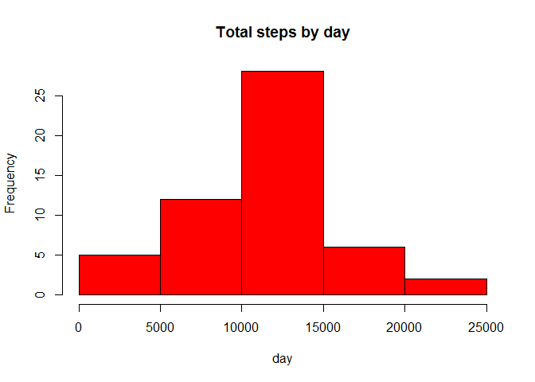
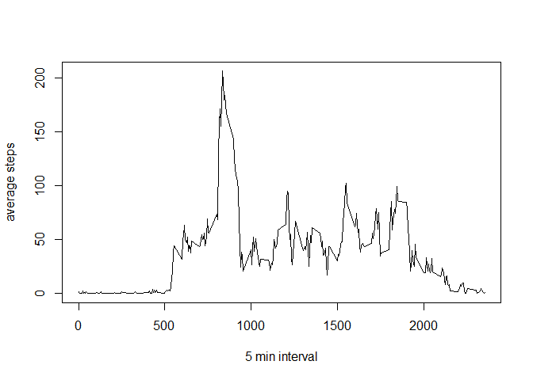
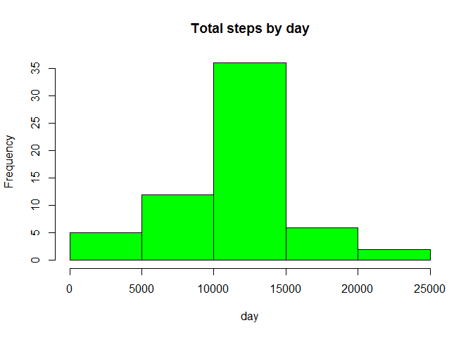
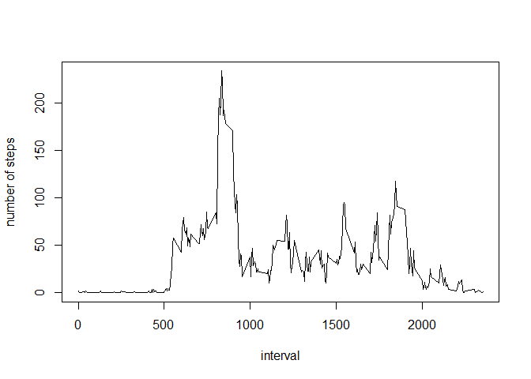
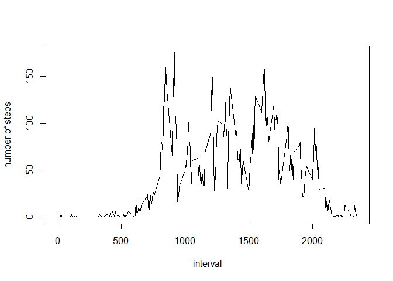

# Reproducible Research: Peer Assessment 1


## Loading and preprocessing the data

```r
data<-read.csv("C:/Users/NM/Documents/activity.csv",colClass=c("numeric","character",'numeric'))
data[,2]<-as.Date(data[,2],"%Y-%m-%d")
head(data)
```

```
##   steps       date interval
## 1    NA 2012-10-01        0
## 2    NA 2012-10-01        5
## 3    NA 2012-10-01       10
## 4    NA 2012-10-01       15
## 5    NA 2012-10-01       20
## 6    NA 2012-10-01       25
```

```r
names(data)
```

```
## [1] "steps"    "date"     "interval"
```

## What is mean total number of steps taken per day?

```r
countdata<-aggregate(steps~date,data=data,sum,na.rm=TRUE)
hist(countdata[,2],col='red',xlab="day",main = "Total steps by day")
```

 

```r
mean(countdata$steps)
```

```
## [1] 10766.19
```

```r
median(countdata$steps)
```

```
## [1] 10765
```


## What is the average daily activity pattern?

```r
interval_mean<-tapply(data$steps,data$interval,mean,na.rm=TRUE)
plot(unique(data$interval),interval_mean,type="l",xlab="5 min interval",ylab="average steps")
```

 

```r
a<-which.max(interval_mean)
names(a)
```

```
## [1] "835"
```

```r
# unique(data$interval)[a]
```

## Imputing missing values

```r
data_with_no_na=data
interval_mean=tapply(data_with_no_na$steps,data$interval,mean,na.rm=TRUE)
for(i in 1:nrow(data_with_no_na)){
   if_na=is.na(data_with_no_na$steps[i])
   interval_na=data_with_no_na$interval[i]
   if (if_na){
     data_with_no_na$steps[i]=interval_mean[as.character(interval_na)]
   }
 }
countdata_no_na=aggregate(steps~date,data=data_with_no_na,sum,na.rm=TRUE)
hist(countdata_no_na[,2],col='green',xlab="day",main = "Total steps by day")
```

 

```r
mean(countdata_no_na$steps)
```

```
## [1] 10766.19
```

```r
median(countdata_no_na$steps)
```

```
## [1] 10766.19
```
 Mean is same while Median differs

## Are there differences in activity patterns between weekdays and weekends?

```r
daylevel=vector()
for( i in 1:nrow(data)){
  day=weekdays(data$date[i])
  if (day=="Sunday"| day=="Saturday"){
    daylevel[i]="weekend"
  }
  else 
    daylevel[i]="weekday"
  }
data$daylevel=as.factor(daylevel)
head(data)
```

```
##   steps       date interval daylevel
## 1    NA 2012-10-01        0  weekday
## 2    NA 2012-10-01        5  weekday
## 3    NA 2012-10-01       10  weekday
## 4    NA 2012-10-01       15  weekday
## 5    NA 2012-10-01       20  weekday
## 6    NA 2012-10-01       25  weekday
```
Daylevel factor added into data  
Now summing data with respect to intervals and grouping with daylevel

```r
stepsByDay <- aggregate(steps ~ interval + daylevel, data = data, mean)
```
Plots

```r
plot(unique(stepsByDay$interval),
     stepsByDay[stepsByDay$daylevel=="weekday",3],type="l",
     xlab="interval",ylab="number of steps")
```

 

```r
plot(unique(stepsByDay$interval),
     stepsByDay[stepsByDay$daylevel=="weekend",3],type="l",
     xlab="interval",ylab="number of steps")
```

 

